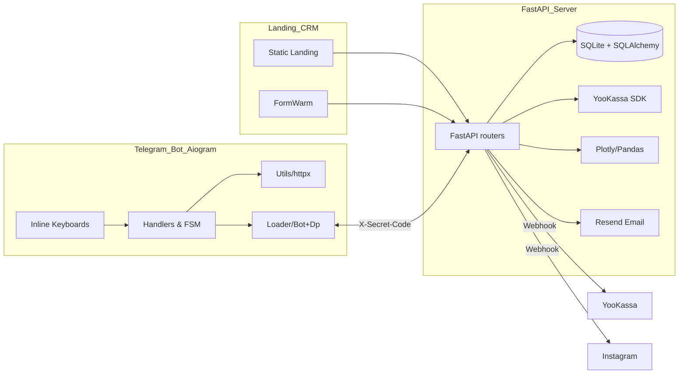

# AiM Pay Bot Platform

     

> Платформа сочетает Telegram-бота на Aiogram и микросервис на FastAPI, закрывая полный цикл: лидогенерация, оплата, реферальные выплаты, сертификация, CRM и аналітика — всё «из коробки».

- Мгновенная регистрация обработчиков через `button_handlers` и middleware для anti-spam.
- Интеграция с YooKassa (платежи + открытые выплаты) и Resend для email-нотификаций.
- Многослойная аналитика: Excel, Plotly, отчеты по UTM и рефералам, CRM API, warm-up-воронка, чат с DeepSeek.
- Генерация именных PDF-сертификатов с QR-кодом, хранением в БД и публичным просмотровым endpoint.
- Жесткая безопасность: секретные заголовки, whitelist IP YooKassa, idempotency, blacklist пользователей.
---

## Содержание

1. [Обзор архитектуры](#обзор-архитектуры)
2. [Телеграм-бот (`AiM_Pay_Bot_bot`)](#телеграм-бот-aim_pay_bot_bot)
3. [Сервер (`AiM_Pay_Bot_server`)](#сервер-aim_pay_bot_server)
4. [Оплата, рефералы и сертификаты](#оплата-рефералы-и-сертификаты)
5. [CRM, лиды и отчеты](#crm-лиды-и-отчеты)
6. [Безопасность](#безопасность)
7. [Стек технологий](#стек-технологий)
8. [Быстрый старт](#быстрый-старт)
9. [FAQ / Roadmap](#faq--roadmap)

---

## Обзор архитектуры



Ключевые принципы:

- **Модульность**: бот и сервер разделены, но общаются строго через HTTP c подписью `X-Secret-Code` и единый `.env`.
- **Слои масштабирования**: запуск FastAPI + APScheduler, отдельный веб-сервер для телеграм webhook или polling, рендеринг Excel и Plotly в отдельных задачах.
- **Асинхронность**: aiogram + httpx + databases (aiosqlite) обеспечивают неблокирующий I/O.

---

## Телеграм-бот (`AiM_Pay_Bot_bot`)

### Слой событий и регистрация хэндлеров

- `loader.py` инициализирует `Bot` / `Dispatcher`, a middleware `ThrottlingMiddleware` блокирует спам (`utils.py`).
- `button_handlers.py` хранит **единый словарь** колбэков + универсальный регистратор, что ускоряет подключение новых кнопок.

```
```6:34:AiM_Pay_Bot_bot/button_handlers.py
callback_handlers = {
    "start": start,
    "generate_report": generate_clients_report,
    "request_referral_chart": request_referral_chart,
    "get_certificate": get_certificate,
    "fake_buy_course": fake_buy_course,
    ...
}
```

- Любое новое действие описывается функцией и добавляется в словарь — регистрировать декораторы не нужно.

### Business flow в `handlers.py`

- **Onboarding**: `/start` прогревает referrer, создает юзера, пушит ADMINS, и уже на первом шаге подготавливает кнопку оплаты и видео приветствия.
- **Реферальный модуль**: выдача ссылок с кэшем (`links_cache`), построение отчётов, графиков и Excel.
- **Карточные данные**: временное состояние `user_payment_email_flow` удерживает контекст ввода карты и email, пока сервер не подтвердит сохранение.
- **Отчётность**: `generate_clients_report` тянет агрегаты, `report_list_as_file` отдаёт Excel (binary response) и тут же рассылает через Telegram.
- **Сертификация**: `get_certificate` запускает тест → запрос ФИО → выдача PDF или публичной ссылки.

```
```344:392:AiM_Pay_Bot_bot/handlers.py
keyboard.add(
    InlineKeyboardButton("Напечатать список в Excel-таблице", callback_data='report_list_as_file'),
    InlineKeyboardButton("Построить график оплат рефералов", callback_data='request_referral_chart'),
)
response = await send_request(clients_report_url, method="POST", json=user_data)
```

### Помощники (`utils.py`)

- `send_request` инкапсулирует httpx + добавляет `X-Secret-Code` во все вызовы.
- `ThrottlingMiddleware` блокирует частые сообщения на уровне dispatcher.
- `test_questions` набор из 30+ вопросов для получения сертификата.

```
```14:47:AiM_Pay_Bot_bot/utils.py
async def send_request(url, method="GET", headers=None, **kwargs):
    headers["X-Secret-Code"] = SECRET_CODE
    async with httpx.AsyncClient() as client:
        ...
```

---

## Сервер (`AiM_Pay_Bot_server`)

### FastAPI ядро

- `server.py` подключает `database`, стартует APScheduler, регистрирует middleware для автоподключения БД.
- Разделение endpoint-ов по доменам: `api/base.py` (основная логика), `api/kassa.py` (платежи/пин-ауты), `api/store_db.py` (хранилище/обработчики событий).

```
```18:52:AiM_Pay_Bot_server/server.py
scheduler = AsyncIOScheduler()
@app.middleware("http")
async def db_session_middleware(request, call_next):
    await database.connect()
    request.state.db = database
    ...
```

### База данных

- SQLite + SQLAlchemy ORM, затем доступ через `databases` (async). Таблицы: `users`, `payments`, `referrals`, `payouts`, `leads`, `sources`, `chat_messages`, `settings`.

```
```25:145:AiM_Pay_Bot_server/database.py
class User(Base):
    telegram_id = Column(String, unique=True)
    paid = Column(Boolean, default=False)
    balance = Column(Integer, default=0)
    card_synonym = Column(String, unique=True, nullable=True)
...
class Lead(Base):
    email = Column(String, nullable=True)
    source_id = Column(Integer, ForeignKey('sources.id'))
```

- `initialize_settings_once` заливает дефолтные параметры (стоимость курса, ссылки, ключи).

### API Highlights

- `/start`, `/check_user`, `/generate_clients_report(_list)` — первичные endpoints для бота.
- `/track_visit`, `/save_source_and_chat_history`, `/form_warm/*` — построение CRM и warm-up воронок.
- `/api/chat/*` — асинхронный чат с DeepSeek (short answers, 10 сообщений лимит).
- `/api/referrals/*` — CRM endpoints для рефералов, manual payouts, leaderboard.

```
```1588:1659:AiM_Pay_Bot_server/api/base.py
@app.post("/save_referral_phone")
async def save_referral_phone(...):
    norm_phone = normalize_and_validate_phone(phone)
    lead_id = await get_or_create_lead_by_email(email=None, telegram_id=str(telegram_id), ...)
```

### Утилиты и сервисы

- `utils.py` — `exception_handler`, `verify_secret_code`, `check_yookassa_ip`, Resend email sender (с fallback’ами), Yandex Metrika goals.

```
```62:138:AiM_Pay_Bot_server/utils.py
ALLOWED_YOOKASSA_IP_RANGES = [...]
def check_yookassa_ip(request: Request):
    forwarded_for = request.headers.get("X-Forwarded-For")
    ...
    if client_ip_address in allowed_ip_range:
        return client_ip
```

---

## Оплата, рефералы и сертификаты

### YooKassa pipeline

1. `/create_payment` валидирует пользователя, email, idempotence key и создаёт платёж через SDK.
2. YooKassa шлёт вебхук `/payment_notification` (IP whitelist). Сервер подтверждает оплату, повышает баланс реферера, отправляет invite-link через дополнительный microservice (`MAHIN_URL`), дублирует его на почту (Resend) и в Telegram.
3. `/payout_balance`, `/mark_referral_paid` помогают финансисту отслеживать обязательства и вручную подтверждать выплаты.

```
```43:163:AiM_Pay_Bot_server/api/kassa.py
payment_data = {"amount": {"value": f"{amount:.2f}", "currency": "RUB"}, ...}
payment = Payment.create(payment_data, idempotence_key)
```

### Реф. аналитика и отчеты

- Бот умеет распечатать список приглашенных пользователей или выгрузить Excel (pandas + xlsxwriter) и построить Plotly-графики в публичном endpoint.

```
```505:541:AiM_Pay_Bot_server/api/base.py
df = pd.DataFrame(invited_list)
with pd.ExcelWriter(file_path, engine="xlsxwriter") as writer:
    df.to_excel(writer, sheet_name="Report", index=False)
return FileResponse(..., filename="clients_report.xlsx")
```

### Сертификация

- `generate_certificate_file` (ReportLab + PyPDF2 + qrcode) собирает именной сертификат, подписывает датой ФИО, встраивает QR на публичную страницу `/certifications?cert_id=...`.

```
```927:1038:AiM_Pay_Bot_server/api/base.py
qr_data = f"{str(await get_setting('SERVER_URL'))}/certifications?cert_id={cert_id}"
c.drawString(x, 235, name)
c.drawImage(ImageReader(qr_path), 35, 35, 138, 138)
```

---

## CRM, лиды и отчеты

- **UTM tracking** (`/track_visit`) создаёт источники до того, как пользователь оставит контакты.
- **Формы** (`/save_source_and_chat_history`) объединяют лиды по email/phone, линкуют с источником и сохраняют чат (localStorage → API).
- **FormWarm**: `/form_warm/clients`, `/progress`, `/touch` строят этапы воронки и фиксируют каждое действие.
- **Chat**: `/api/chat/send` использует DeepSeek для лаконичных ответов, ограничивает текст и количество сообщений, хранит историю в `chat_messages`.

```
```1713:1768:AiM_Pay_Bot_server/api/base.py
if len(message) > 200:
    return JSONResponse({"message": "Пожалуйста, задавайте краткие вопросы..."})
response_text = await get_chat_deepseek_response(message, history_for_ai)
```

---

## Безопасность

- **Секретные заголовки**: все приватные endpoints требуют `X-Secret-Code`, проверяются на сервере.
- **IP whitelist**: `check_yookassa_ip` отклоняет вебхуки вне диапазона YooKassa.
- **Idempotence**: платежи и выплаты создаются с UUID-ключами.
- **Blacklist + throttling**: бот может мгновенно заблокировать пользователя или кикнуть из группы; middleware ограничивает частые сообщения (`AiM_Pay_Bot_bot/handlers.py`).
- **Санитайзеры**: email/phone валидаторы, строгие regex на сервере и боте.
- **Файловый lifecycle**: Excel/PDF удаляются после отправки (`background_tasks.add_task(delete_file, path)`).

---

## Стек технологий

| Зона | Технологии / библиотеки |
| --- | --- |
| Бот | Python 3.11+, Aiogram, httpx, inline keyboards, FSM, custom middleware |
| Сервер | FastAPI, uvicorn, APScheduler, httpx, Jinja2, Plotly, Pandas, ReportLab, PyPDF2, qrcode |
| БД | SQLite (aiosqlite) + SQLAlchemy ORM + `databases` |
| Платежи | YooKassa SDK (payments + payouts), card binding синхронизация |
| Email / Push | Resend API (fallback keys), Yandex.Metrika goals, DeepSeek chat completions |
| Отчёты | pandas/xlsxwriter, Plotly (interactive), HTML templates |
| CRM | кастомные REST endpoints (`/form_warm/*`, `/api/referrals/*`, `/api/chat/*`) |

---

## Быстрый старт

```bash
# 1. Клонировать и создать .env для обоих модулей
cp AiM_Pay_Bot_bot/.env.example AiM_Pay_Bot_bot/.env
cp AiM_Pay_Bot_server/.env.example AiM_Pay_Bot_server/.env

# 2. Установить зависимости
pip install -r AiM_Pay_Bot_bot/requirements.txt
pip install -r AiM_Pay_Bot_server/requirements.txt

# 3. Прогреть БД и настройки
cd AiM_Pay_Bot_server && python -c "from database import initialize_database; initialize_database()"

# 4. Запустить API + бот
uvicorn server:app --reload --port 8000
python AiM_Pay_Bot_bot/mahin.py  # polling
```


